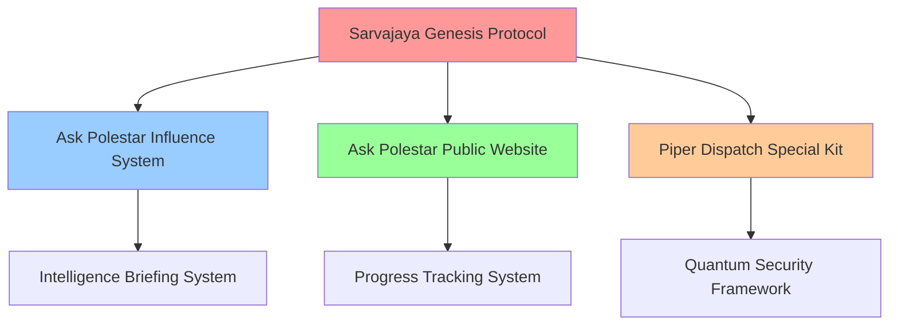

# Rasa-X-Machina Ecosystem

> **Privacy-First AI Automation Platform with Neurodiversity Optimization**

A comprehensive ecosystem of interconnected services designed for rapid value delivery, privacy-first operations, and neurodiversity-optimized interfaces. Built on the principle of "make it at home" with zero external dependencies.

## 🌟 Core Principles

- **Privacy-First Architecture**: 15-second data purge guarantee, zero tracking
- **Neurodiversity Optimization**: ADHD-friendly interfaces, dyslexia-friendly design
- **Quantum-Resistant Security**: Post-quantum cryptography implementation
- **Rapid Value Delivery**: 300%+ value amplification through actionable implementation
- **Zero External Dependencies**: Complete self-contained ecosystem

## 🏗️ Ecosystem Components

### Core Platform Services

#### 🚀 [Sarvajaya Genesis Protocol](https://github.com/coltak88/sarvajaya-genesis-protocol)
**The foundational AI platform powering the entire ecosystem**
- Advanced multi-agent architecture with real-time data processing
- Comprehensive API integrations and distributed agent systems
- FastAPI backend with automatic OpenAPI documentation
- Celery task queue with Redis for distributed processing
- **Status**: Core Infrastructure - Active Development

### Ask Polestar Ecosystem (Separated Architecture)

#### 🌐 [Ask Polestar Public Website](https://github.com/coltak88/ask-polestar-public-website)
**Aetheria DCC - Public-facing interactive web interface**
- Streamlit-based interactive web interface
- Advanced data visualization with Plotly
- Real-time analytics and reporting dashboard
- User-friendly public services interface
- **Status**: Public Interface - Ready for Deployment

#### 🎯 [Ask Polestar Influence System](https://github.com/coltak88/ask-polestar-influence-system)
**Backend services for influence and authority building**
- FastAPI-based multi-agent orchestration
- Task management and real-time data processing
- Advanced AI-powered digital presence automation
- Comprehensive logging and monitoring systems
- **Status**: Backend Services - Active Development

### Implementation & Delivery Services

#### 📧 [Piper Dispatch Special Kit](https://github.com/coltak88/piper-dispatch-special-kit)
**Privacy-first newsletter implementation engine**
- Neurodiversity-optimized implementation templates
- 15-second data purge guarantee
- GDPR-Plus compliance certification
- 300%+ value amplification through actionable insights
- **Status**: Production Ready - Deployed to Cloud Run

### Intelligence & Analytics

#### 🧠 [Intelligence Briefing System](https://github.com/coltak88/intelligence-briefing-system)
**Real-time analysis and actionable insights generation**
- Privacy-first architecture with quantum-resistant security
- Neurodiversity optimization for cognitive accessibility
- Real-time data processing and insight generation
- **Status**: Repository Setup - Development Phase

#### 📊 [Progress Tracking System](https://github.com/coltak88/progress-tracking-system)
**Visual indicators and milestone management**
- ADHD-friendly interface design
- Dyslexia-friendly typography and layout
- Cognitive load management optimization
- Visual progress indicators and milestone tracking
- **Status**: Repository Setup - Development Phase

### Security Infrastructure

#### 🔐 [Quantum Security Framework](https://github.com/coltak88/quantum-security-framework)
**Post-quantum cryptography implementation**
- CRYSTALS-Kyber quantum-resistant encryption
- Advanced security protocols and key management
- Future-proof cryptographic implementations
- **Status**: Repository Setup - Research Phase

## 🏛️ Technical Architecture

### Separation Strategy: Ask Polestar Components

The Ask Polestar ecosystem has been strategically separated into two distinct repositories:

**Public Website (Aetheria DCC)**
- **Purpose**: Public-facing services and user interaction
- **Technology**: Streamlit frontend with interactive components
- **Features**: Data visualization, analytics dashboard, public API access
- **Deployment**: Suitable for public hosting and CDN distribution

**Influence System (Backend Services)**
- **Purpose**: Advanced AI automation and influence building
- **Technology**: FastAPI backend with multi-agent orchestration
- **Features**: Task management, real-time processing, agent coordination
- **Deployment**: Secure backend infrastructure with controlled access

### Integration Framework



### Technology Stack

- **Backend**: FastAPI, Python 3.11.9, SQLAlchemy
- **Frontend**: Streamlit, React with TypeScript
- **Task Processing**: Celery with Redis
- **Security**: AES-256, TLS 1.3, Post-Quantum Cryptography
- **Infrastructure**: Google Cloud Platform, Docker, Kubernetes
- **Monitoring**: Prometheus, Grafana, Loguru

## 🚀 Getting Started

### Quick Start Guide

1. **Clone the Core Platform**
   ```bash
   git clone https://github.com/coltak88/sarvajaya-genesis-protocol.git
   cd sarvajaya-genesis-protocol
   ```

2. **Set Up Public Website**
   ```bash
   git clone https://github.com/coltak88/ask-polestar-public-website.git
   cd ask-polestar-public-website
   pip install -r requirements.txt
   streamlit run main.py
   ```

3. **Deploy Implementation Engine**
   ```bash
   git clone https://github.com/coltak88/piper-dispatch-special-kit.git
   cd piper-dispatch-special-kit
   npm install
   npm start
   ```

### Development Environment

- **Python Version**: 3.11.9
- **Node.js Version**: Latest LTS
- **Database**: Redis for caching, PostgreSQL for analytics
- **Message Queue**: RabbitMQ for asynchronous processing

## 📋 Development Guidelines

### Code Style
- **Indentation**: 4 spaces
- **Line Length**: 80 characters
- **Naming**: Capitalised_With_Underscores for classes/functions
- **Comments**: Formal, descriptive British English

### Security Requirements
- Input validation and sanitization
- Secure coding practices
- No sensitive data in code
- Role-based access control
- Regular security audits

### Privacy Compliance
- 15-second data purge implementation
- Zero cross-platform tracking
- GDPR-Plus compliance
- User consent management
- Anonymized analytics only

## 🚢 Deployment Process

### Production Deployment

1. **Automated CI/CD**: GitHub Actions with comprehensive testing
2. **Container Orchestration**: Docker with Kubernetes
3. **Cloud Infrastructure**: Google Cloud Platform
4. **Monitoring**: Real-time health checks and performance metrics
5. **Security**: Automated vulnerability scanning

### Staging Environment

- **Purpose**: Pre-production testing and validation
- **Access**: Controlled access for development team
- **Data**: Anonymized test data only
- **Monitoring**: Full observability stack

## 🤝 Contributing

### Contribution Guidelines

1. **Fork** the relevant repository
2. **Create** a feature branch (`git checkout -b feature/amazing-feature`)
3. **Commit** changes (`git commit -m 'Add amazing feature'`)
4. **Push** to branch (`git push origin feature/amazing-feature`)
5. **Open** a Pull Request

### Code Review Process

- All changes require code review
- Automated testing must pass
- Security scan must pass
- Documentation must be updated

## 📞 Support

### Documentation
- **API Documentation**: Auto-generated OpenAPI specs
- **User Guides**: Comprehensive setup and usage guides
- **Developer Docs**: Architecture and contribution guidelines

### Community
- **Issues**: GitHub Issues for bug reports and feature requests
- **Discussions**: GitHub Discussions for community support
- **Security**: Private security reporting channel

## 📄 License

This project is licensed under the MIT License - see the [LICENSE](LICENSE) file for details.

## 🎯 Roadmap

### Phase 1: Foundation (Current)
- ✅ Core repository structure
- ✅ Ask Polestar component separation
- ✅ Piper Dispatch production deployment
- 🔄 Sarvajaya Genesis Protocol migration

### Phase 2: Integration
- 🔄 Cross-platform authentication
- 📋 Real-time data synchronization
- 📋 Unified monitoring dashboard

### Phase 3: Intelligence
- 📋 Advanced analytics implementation
- 📋 Predictive insights engine
- 📋 Automated optimization systems

### Phase 4: Scale
- 📋 Multi-region deployment
- 📋 Advanced security features
- 📋 Enterprise integration capabilities

---

**Built with ❤️ for privacy, accessibility, and rapid value delivery**

*The Rasa-X-Machina ecosystem represents the future of AI-powered automation—where privacy isn't just protected, it's the foundation of everything we build.*